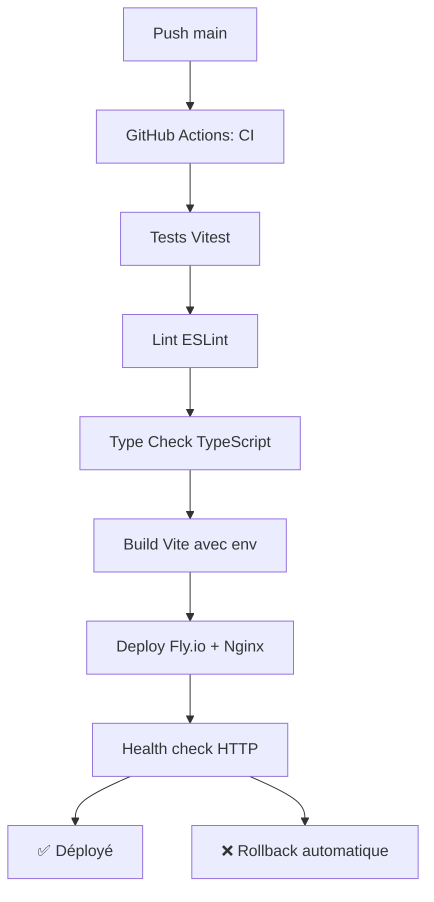

# Protocole de Déploiement - Frontend MapQuiz

## 🎯 **Vue d'Ensemble**

Ce document décrit le protocole de déploiement continu pour le frontend MapQuiz (React/Vite), hébergé sur Fly.io avec serveur Nginx optimisé.

## 🏗️ **Architecture de Déploiement**

### **Composants Frontend**

- **Application** : `frontend-lively-star-6238.fly.dev`
- **Build Tool** : Vite (bundling optimisé)
- **Serveur Web** : Nginx (conteneur de production)
- **Plateforme** : Fly.io avec build arguments dynamiques

### **Environnements**

- **Production** : Branche `main` → Déploiement automatique
- **Développement** : Branche `develop` → Tests automatiques
- **Feature** : Branches de fonctionnalités → Tests PR

## 🔄 **Séquence de Déploiement Production**

**Déclenchement** : Push sur `main`



### **Étapes Détaillées**

1. **Tests et Validation** (3-5 minutes)
   - Tests unitaires et composants
   - Vérification ESLint
   - Type checking TypeScript
   - Build de validation

2. **Build Optimisé** (2-3 minutes)
   - Vite build avec variables d'environnement
   - Optimisation assets (CSS, JS, images)
   - Tree shaking et code splitting
   - Génération source maps

3. **Déploiement** (2-4 minutes)
   - Build Docker avec Nginx
   - Injection variables d'environnement
   - Déploiement sans interruption
   - Health check automatique

## ⚙️ **Configuration Requise**

### **Build Arguments Production**

```dockerfile
# Variables injectées au build
API_URL=https://backend-solitary-moon-1875.fly.dev/api
AUTH_URL=https://backend-solitary-moon-1875.fly.dev
WS_URL=wss://backend-solitary-moon-1875.fly.dev/ws
```

### **Variables d'Environnement Build**

```env
# Variables Vite (préfixe VITE_ requis)
VITE_API_URL=https://backend-solitary-moon-1875.fly.dev/api
VITE_WS_URL=wss://backend-solitary-moon-1875.fly.dev/ws

# Better Auth (pas de préfixe VITE_)
BETTER_AUTH_URL=https://backend-solitary-moon-1875.fly.dev

# Environnement
NODE_ENV=production
```

### **Configuration Fly.io**

**Dans `fly.toml` :**

```toml
[build.args]
API_URL='https://backend-solitary-moon-1875.fly.dev/api'
AUTH_URL='https://backend-solitary-moon-1875.fly.dev'
WS_URL='wss://backend-solitary-moon-1875.fly.dev/ws'
```

## 🧪 **Gates de Qualité**

### **Critères Obligatoires**

- ✅ **Tests** : Tous les tests passent
- ✅ **Linting** : 0 erreur ESLint
- ✅ **TypeScript** : 0 erreur de type
- ✅ **Build** : Bundle optimisé réussi
- ✅ **Performance** : Bundle size acceptable

### **Seuils de Performance**

- ⏱️ **Build time** : < 3 minutes
- ⏱️ **Deploy time** : < 2 minutes
- 📦 **Bundle size** : < 2MB gzippé
- 🔍 **Health check** : Réponse < 10 secondes

## 🚀 **Déploiement Manuel**

### **Prérequis**

```bash
# Installation Fly CLI
curl -L https://fly.io/install.sh | sh

# Authentification
fly auth login
```

### **Commandes de Déploiement**

```bash
# Déploiement standard avec build args
fly deploy --remote-only \
  --build-arg API_URL=https://backend-solitary-moon-1875.fly.dev/api \
  --build-arg AUTH_URL=https://backend-solitary-moon-1875.fly.dev \
  --build-arg WS_URL=wss://backend-solitary-moon-1875.fly.dev/ws

# Déploiement avec logs détaillés
fly deploy --remote-only --verbose

# Build local puis déploiement
npm run build
fly deploy --remote-only
```

## 🚨 **Procédures d'Urgence**

### **Rollback Automatique**

En cas d'échec du health check, le déploiement est automatiquement annulé.

### **Rollback Manuel**

```bash
# Lister les releases
fly releases

# Rollback vers version précédente
fly releases rollback [VERSION]

# Rollback d'urgence immédiat
fly releases rollback --force
```

### **Debug Production**

```bash
# Logs Nginx en temps réel
fly logs --tail

# Logs avec filtres
fly logs --tail --region cdg

# SSH dans l'instance (si configuré)
fly ssh console

# Redémarrage application
fly restart

# Status détaillé
fly status --all
```

## 📋 **Checklist Pré-Déploiement**

### **Développeur**

- [ ] Tests locaux passent (`npm run test`)
- [ ] Build local réussi (`npm run build`)
- [ ] Types vérifiés (`npm run build:check`)
- [ ] Lint propre (`npm run lint`)
- [ ] Variables d'environnement vérifiées

### **CI/CD Automatique**

- [ ] Tous les tests passent
- [ ] ESLint sans erreur
- [ ] TypeScript sans erreur
- [ ] Build Vite réussi
- [ ] Bundle size acceptable

## 📋 **Checklist Post-Déploiement**

- [ ] Application accessible (curl https://frontend-lively-star-6238.fly.dev)
- [ ] Pages principales se chargent
- [ ] Authentification fonctionne
- [ ] WebSocket se connecte
- [ ] API backend accessible
- [ ] Assets statiques chargent

## 🔧 **Outils et Composants**

### **Pipeline CI/CD**

- **GitHub Actions** : Orchestration tests et déploiement
- **Fly.io** : Plateforme de déploiement
- **Docker** : Conteneurisation avec Nginx

### **Build & Bundling**

- **Vite** : Build tool moderne et rapide
- **TypeScript** : Compilation et vérification
- **TanStack Router** : Génération des routes
- **Tailwind CSS** : Traitement et optimisation CSS

### **Serveur Web**

- **Nginx** : Serveur web haute performance
- **Gzip compression** : Optimisation bande passante
- **Cache headers** : Performance des assets
- **SPA routing** : Gestion des routes client-side

### **Testing & Quality**

- **Vitest** : Framework de test moderne
- **Testing Library** : Tests de composants
- **ESLint** : Analyse statique du code

## 📊 **Métriques de Performance**

### **Objectifs Production**

- **Temps de chargement initial** : < 2 secondes
- **First Contentful Paint** : < 1 seconde
- **Bundle size** : < 2MB gzippé
- **Disponibilité** : > 99.9%

### **Optimisations Automatiques**

- Code splitting par routes
- Lazy loading des composants
- Tree shaking des dépendances
- Compression assets (CSS, JS, images)

## 🏗️ **Configuration Nginx**

**Fichier `nginx.conf` :**

```nginx
server {
    listen 80;
    root /usr/share/nginx/html;
    index index.html;

    # SPA routing - toutes les routes vers index.html
    location / {
        try_files $uri $uri/ /index.html;
    }

    # Cache des assets statiques
    location /assets/ {
        expires 1y;
        add_header Cache-Control "public, immutable";
    }

    # Compression
    gzip on;
    gzip_types text/css application/javascript application/json;

    # Sécurité
    add_header X-Frame-Options DENY;
    add_header X-Content-Type-Options nosniff;
}
```

## 🔗 **Intégration Backend**

### **URLs de Production**

```typescript
// Configuration production automatique
const config = {
  API_URL: "https://backend-solitary-moon-1875.fly.dev/api",
  WS_URL: "wss://backend-solitary-moon-1875.fly.dev/ws",
  AUTH_URL: "https://backend-solitary-moon-1875.fly.dev",
};
```

### **Gestion des Environnements**

```typescript
// Détection automatique de l'environnement
const isDev = import.meta.env.DEV;
const apiUrl = import.meta.env.VITE_API_URL || "http://localhost:3000/api";
```

## 🚀 **Améliorations Futures**

### **Performance**

- **CDN** : Distribution des assets statiques
- **Service Worker** : Cache offline intelligent
- **Image optimization** : Formats modernes (WebP, AVIF)

### **Environnements Additionnels**

- **Staging** : Environnement de pré-production
- **Preview** : Environnements éphémères pour PR
- **A/B Testing** : Déploiements canary

### **Monitoring Avancé**

- **Web Vitals** : Métriques de performance utilisateur
- **Error tracking** : Sentry pour erreurs frontend
- **Analytics** : Suivi des interactions utilisateur

---

**Dernière mise à jour** : Janvier 2025  
**Responsable** : Équipe Frontend MapQuiz  
**Statut** : En production

## 🔗 **Liens Utiles**

- [Guide de développement](./DEVELOPPEMENT.md)
- [Configuration Fly.io](./fly.toml)
- [Configuration Vite](./vite.config.ts)
- [Backend MapQuiz](https://github.com/map-quiz/mapquiz-back)
- [Dashboard Fly.io](https://fly.io/dashboard)
